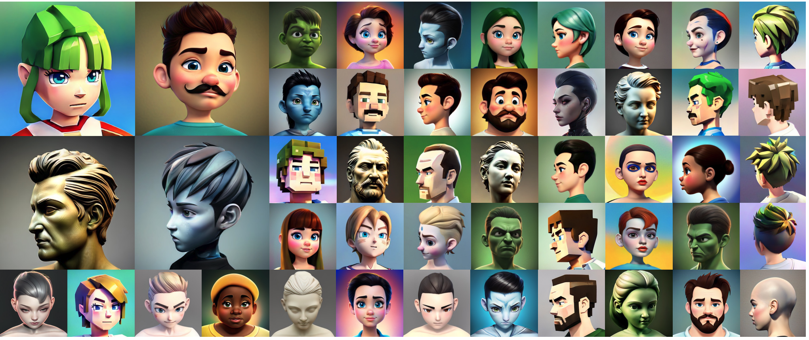

# Official repo for StyleAvatar3D
StyleAvatar3D: Leveraging Image-Text Diffusion Models for High-Fidelity 3D Avatar Generation

[[Arxiv]](https://icoz69.github.io/)

## Abstract

The recent advancements in image-text diffusion models have stimulated research interest in large-scale 3D generative models. Nevertheless, the limited availability of diverse 3D resources presents significant challenges to learning. In this paper, we present a novel method for generating high-quality, stylized 3D avatars that utilizes pre-trained image-text diffusion models for data generation and a Generative Adversarial Network (GAN)-based 3D generation network for training. Our method leverages the comprehensive priors of appearance and geometry offered by image-text diffusion models to generate multi-view images of avatars in various styles. During data generation, we employ poses extracted from existing 3D models to guide the generation of multi-view images. To address the misalignment between poses and images in data, we investigate view-specific prompts and develop a coarse-to-fine discriminator for GAN training. We also delve into attribute-related prompts to increase the diversity of the generated avatars. Additionally, we develop a latent diffusion model within the style space of StyleGAN to enable the generation of avatars based on image inputs. Our approach demonstrates superior performance over current state-of-the-art methods in terms of visual quality and diversity of the produced avatars.

## Demos

Avatars of different styles

https://github.com/icoz69/StyleAvatar3D/assets/22427667/846c0699-a1ce-460b-ae47-3b322d8b4fec

Latent space walk

https://github.com/icoz69/StyleAvatar3D/assets/22427667/cd5c2e34-e370-498e-ac6b-46b4e4cca495

Cartoon character reconstruction 

https://github.com/icoz69/StyleAvatar3D/assets/22427667/b7c6ec00-6488-40d3-b7fe-b035397142ce

